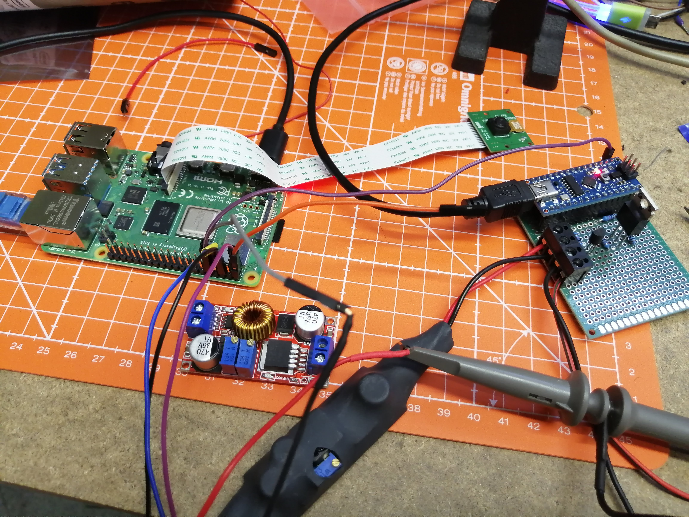

# Solar-powered Raspberry Pi picture camera with Arduino for power-on/off

This project contains Python script that will take a still picture from Raspberry Pi camera after boot and transfer it over network to the FTP server.

The Rpi is periodically turned on and off by Arduino and P-FET. This way the node can work from batteries with solar-charger.

If there is a `update.py` file in the target FTP directory, the script in Rpi is automatically downloaded over FTP and updated. Next time is run this updated version.

# Arduino

### Pinout
- D2 - Output to power on/off the Raspberry Pi using P-FET and NPN transistor. [See this schematic](http://electronics-diy.com/electronic_schematic.php?id=1012).
- A6 - input voltage measurement with 100k/10k voltage divider
- TX1 - UART 115200 sending measured input voltage send in string with newline. Example: `12.6\n` so python can use `readline()`. **Use voltage divider/shifter to convert Arduino's 5V to 3V Rpi**. Connected to pin 10 on Rpi (`UART0_RXD`/`GPIO15`)

# Hardware

- Rpi 3, 4
- Arduino Nano 3

Input voltage 7 - 14 V (Arduino has 10.8 V threshold for battery protection)

Solar panel is using step-down DC/DC converter with CV/CC directly connected to the 3S Li-Ion batteries with balancer module.

This voltage is connected to the VIN of Arduino. Arduino switches power for Raspberry, the 12 V input voltage is stabilized to 5 V thanks to second DC/DC converter.